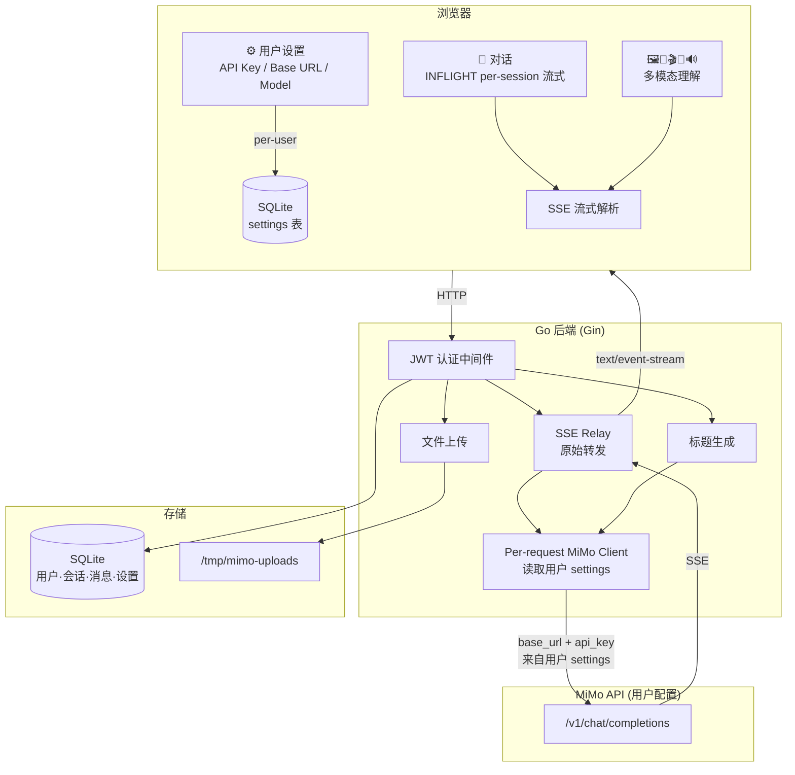

# MiMo WebUI

基于 Go + Alpine.js 构建的 Xiaomi MiMo V2.5 多模态 API Web 界面。单二进制部署，零前端构建依赖。

## 功能

| 功能 | 说明 |
|------|------|
| 💬 对话 | 多 session、流式输出、推理过程展示、附件上传、自动标题生成 |
| 🖼️ 图片理解 | 上传图片或输入 URL，AI 分析图片内容 |
| 🎵 音频理解 | 上传音频，AI 分析音频内容 |
| 🎬 视频理解 | 上传视频或输入 URL，可调帧率和分辨率 |
| 🎤 语音识别 | WAV/MP3 语音转文字，支持中英文 |
| 🔊 语音合成 | 8 种预置音色 + 声音设计 + 声音克隆 |

模型名由用户在前端设置中配置的基础模型名自动拼接后缀：
- 对话/图片/音频/视频：`{model_version}`
- 语音识别：`{model_version}-asr`
- 语音合成：`{model_version}-tts` / `-tts-voicedesign` / `-tts-voiceclone`

## 架构



## 快速开始

```bash
# 1. 克隆 & 构建
git clone https://github.com/GreyRaphael/mimo-webui-go.git
cd mimo-webui-go
cp config.toml.example config.toml
go build -o mimo-webui .
./mimo-webui

# 2. 访问 http://localhost:3000
# 3. 登录（默认 admin / config.toml 中的 admin_password）
# 4. 点击左下角 👤 admin ⚙️ 打开设置，填入：
#    - API Base URL: https://api.xiaomimimo.com/v1
#    - API Key: 你的 MiMo API Key
#    - 模型版本: mimo-v2.5
```

## 用户设置

API 密钥和模型配置通过前端设置弹窗管理，**不在 config.toml 中**。每个用户独立配置，存储在 SQLite `settings` 表中。

点击左下角用户名 → ⚙️ 打开设置弹窗：

| 设置项 | 说明 | 示例 |
|--------|------|------|
| API Base URL | MiMo API 地址 | `https://api.xiaomimimo.com/v1` |
| 模型版本 | 基础模型名，自动拼接后缀 | `mimo-v2.5` / `mimo-v2.5-pro` |
| API Key | MiMo API 密钥 | `tp-xxxx...` |

## 部署

### 从 Release 安装（推荐）

无需 Go 环境，直接下载预编译二进制：

```bash
# 1. 从 GitHub Releases 下载
wget https://github.com/GreyRaphael/mimo-webui-go/releases/download/v1.0.0/mimo-webui-v1.0.0-linux-amd64.tar.gz

# 2. 解压 & 安装
tar xzf mimo-webui-*-linux-amd64.tar.gz
cd mimo-webui-*-linux-amd64
sudo bash install.sh

# 3. 编辑配置
sudo nano /etc/mimo-webui/config.toml

# 4. 重启
sudo systemctl restart mimo-webui
```

安装后文件布局：
```
/usr/local/bin/mimo-webui              # 二进制
/etc/mimo-webui/config.toml            # 服务配置
/etc/mimo-webui/mimo-webui.db          # 数据库（自动创建）
```

常用运维命令：
```bash
journalctl -u mimo-webui -f            # 实时日志
sudo systemctl restart mimo-webui      # 重启
sudo systemctl stop mimo-webui         # 停止
```

### 卸载

```bash
sudo bash uninstall.sh
```

### 发布新版本

```bash
# 方式 1：gh CLI（推荐）
gh auth login
git tag v1.0.0 && git push origin main && git push origin v1.0.0

# 方式 2：Personal Access Token
git remote set-url origin https://<TOKEN>@github.com/GreyRaphael/mimo-webui-go.git
git tag v1.0.0 && git push origin main && git push origin v1.0.0
```

GitHub Actions 流程：`push tag v*` → 编译 linux/amd64 → 打包 tar.gz → 创建 Release

### 从源码构建

```bash
go build -o mimo-webui .
./mimo-webui -config config.toml
```

## 配置

`config.toml` 只包含服务端配置，**不包含 API 密钥**：

```toml
[server]
host = "0.0.0.0"
port = 3000

[auth]
jwt_secret = "change-me"              # 生产环境必须修改
admin_password = "your-password"      # 首次启动创建 admin 账户

[upload]
max_image_mb = 50
max_audio_mb = 100
max_video_mb = 500
temp_dir = "/tmp/mimo-uploads"

[database]
path = "/etc/mimo-webui/mimo-webui.db"
```

## 项目结构

```
mimo-webui-go/
├── main.go                      # 入口 + 路由注册
├── config.toml.example          # 配置模板
├── internal/
│   ├── config/config.go         # TOML 配置解析（仅服务端配置）
│   ├── auth/                    # JWT + bcrypt
│   ├── db/                      # SQLite CRUD
│   │   ├── users.go             # 用户
│   │   ├── sessions.go          # 会话
│   │   ├── messages.go          # 消息
│   │   └── settings.go          # 用户设置 (api_key, base_url, model_version)
│   ├── mimo/                    # MiMo API Client + SSE + TTS
│   ├── handlers/
│   │   ├── chat.go              # 对话 (INFLIGHT 流式)
│   │   ├── settings.go          # GET/PUT /api/settings
│   │   ├── mimo_client.go       # Per-request client (用户 settings → MiMo client)
│   │   ├── image/audio/video.go # 多模态理解
│   │   ├── asr.go / tts.go      # ASR / TTS
│   │   └── upload.go / relay.go # 文件上传 / SSE 转发
│   └── middleware/              # JWT 认证 + 临时文件清理
├── templates/pages/             # Alpine.js 前端页面
├── static/
│   ├── css/custom.css           # 样式 + 移动端适配
│   └── js/app.js                # 导航 + 设置 + IndexedDB
└── deploy/
    ├── install.sh               # systemd 安装
    └── uninstall.sh             # 卸载
```

## 关键设计

### Per-User MiMo Client

每个请求从 SQLite `settings` 表读取用户的 `api_key`、`base_url`、`model_version`，创建独立的 MiMo API Client。不依赖全局配置。

### INFLIGHT 流式模式

借鉴 [nesquena/hermes-webui](https://github.com/nesquena/hermes-webui)，per-session 流式状态存储在 `_inflight[sid]` 中。切换 session 只改变视图，不中断流。浏览器断开后，后端用 `context.Background()` 继续接收 API 响应并保存到 DB。

### 移动端适配

- PC 端：三栏布局（导航 + Session 列表 + 内容区）
- 移动端：☰ 汉堡菜单滑出导航抽屉，📋 按钮滑出 Session 列表

## API 端点

| 方法 | 路径 | 说明 |
|------|------|------|
| POST | `/api/register` | 注册 |
| POST | `/api/login` | 登录 |
| GET | `/api/settings` | 获取用户设置 |
| PUT | `/api/settings` | 更新用户设置 |
| GET | `/api/sessions` | 列出 sessions |
| POST | `/api/sessions` | 创建 session |
| DELETE | `/api/sessions/:id` | 删除 session |
| GET | `/api/sessions/:id/messages` | 获取消息 |
| POST | `/api/sessions/:id/messages` | 发送消息 (SSE 流式) |
| POST | `/api/sessions/:id/generate-title` | 自动生成标题 |
| POST | `/api/upload` | 上传文件 |
| GET | `/api/media/:file_id` | 获取上传文件 |
| POST | `/api/image` | 图片理解 |
| POST | `/api/audio` | 音频理解 |
| POST | `/api/video` | 视频理解 |
| POST | `/api/asr` | 语音识别 |
| POST | `/api/tts` | 语音合成 |

## License

MIT
