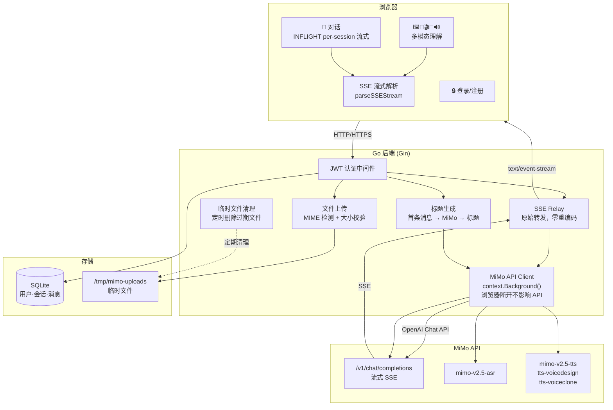
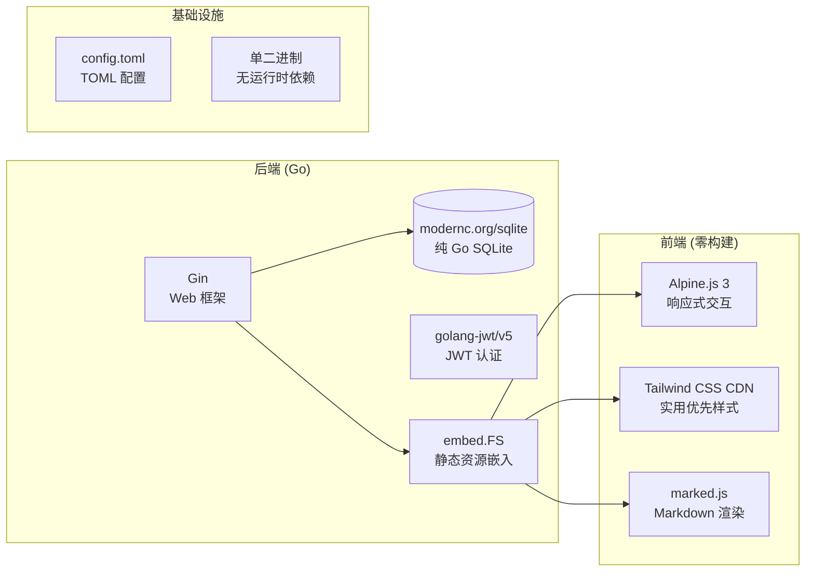
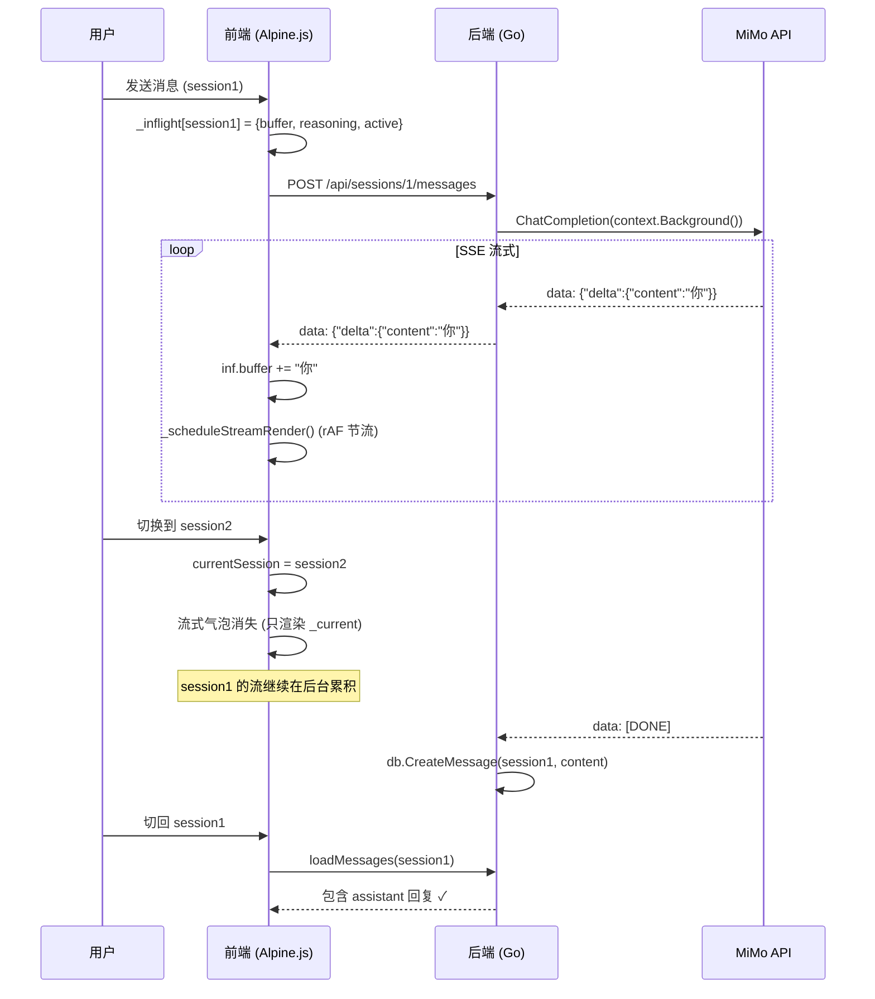
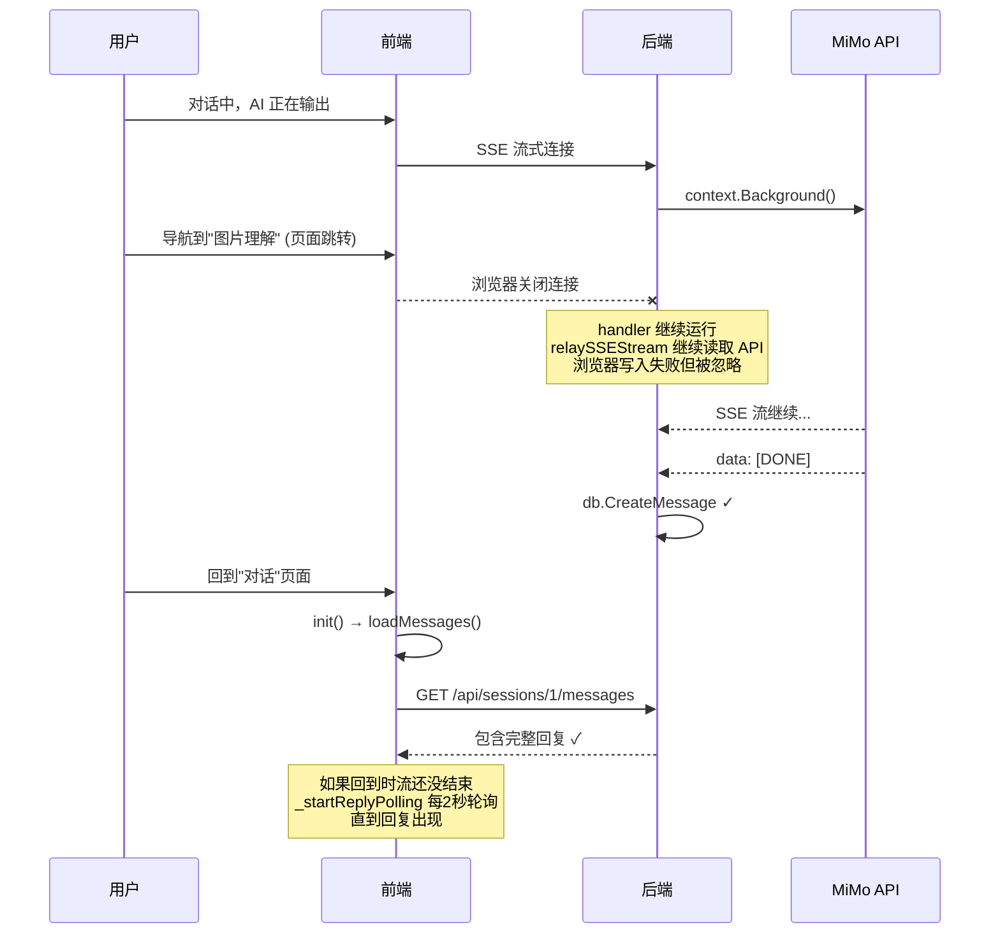
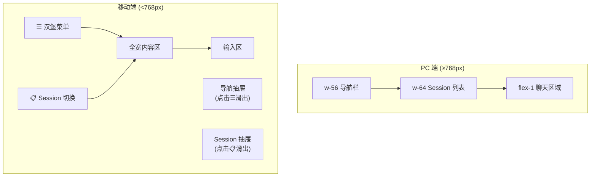

# MiMo WebUI

基于 Go + Alpine.js 构建的 Xiaomi MiMo V2.5 多模态 API Web 界面。单二进制部署，零前端构建依赖。

## 功能

| 功能 | 模型 | 说明 |
|------|------|------|
| 💬 对话 | `mimo-v2.5` / `mimo-v2.5-pro` | 多 session、流式输出、推理过程展示、附件上传、自动标题生成 |
| 🖼️ 图片理解 | `mimo-v2.5` | 上传图片或输入 URL，AI 分析图片内容 |
| 🎵 音频理解 | `mimo-v2.5` | 上传音频，AI 分析音频内容 |
| 🎬 视频理解 | `mimo-v2.5` | 上传视频或输入 URL，可调帧率和分辨率 |
| 🎤 语音识别 | `mimo-v2.5-asr` | WAV/MP3 语音转文字，支持中英文 |
| 🔊 语音合成 | `mimo-v2.5-tts` | 8 种预置音色 + 声音设计 + 声音克隆 |

## 架构



## 技术栈



## 快速开始

```bash
# 1. 克隆
git clone https://github.com/GreyRaphael/mimo-webui-go.git
cd mimo-webui-go

# 2. 配置
cp config.toml.example config.toml
# 编辑 config.toml，填入你的 MiMo API Key

# 3. 构建 & 运行
go build -o mimo-webui .
./mimo-webui

# 4. 访问
# http://localhost:3000
# 默认账号：admin / config.toml 中的 admin_password
```

## 配置

```toml
[server]
host = "0.0.0.0"
port = 3000

[mimo]
api_key = "your-mimo-api-key"        # 或 MIMO_API_KEY 环境变量
base_url = "https://api.xiaomimimo.com/v1"

[auth]
jwt_secret = "change-me"              # 生产环境必须修改
admin_password = "your-password"      # 首次启动创建 admin 账户

[upload]
max_image_mb = 50
max_audio_mb = 100
max_video_mb = 500
temp_dir = "/tmp/mimo-uploads"

[database]
path = "mimo-webui.db"
```

## 项目结构

```
mimo-webui-go/
├── main.go                      # 入口 + 路由注册
├── config.toml.example          # 配置模板
├── internal/
│   ├── config/config.go         # TOML 配置解析
│   ├── auth/                    # JWT + bcrypt
│   ├── db/                      # SQLite CRUD (users/sessions/messages)
│   ├── mimo/                    # MiMo API Client + SSE + TTS
│   ├── handlers/                # HTTP Handlers
│   │   ├── chat.go              # 对话 (INFLIGHT 流式 + 标题生成)
│   │   ├── image/audio/video.go # 多模态理解
│   │   ├── asr.go               # 语音识别
│   │   ├── tts.go               # 语音合成
│   │   ├── upload.go            # 文件上传 + 媒体服务
│   │   └── relay.go             # SSE 原始转发
│   └── middleware/              # JWT 认证 + 临时文件清理
├── templates/pages/             # Go HTML 模板 (Alpine.js)
├── static/
│   ├── css/custom.css           # 全局样式 + 移动端适配
│   └── js/app.js                # IndexedDB + 移动端导航
└── mimo-webui.db                # SQLite 数据库 (自动生成)
```

## 关键设计

### INFLIGHT 流式模式

借鉴 [nesquena/hermes-webui](https://github.com/nesquena/hermes-webui) 的 per-session 状态管理：



### 浏览器断开恢复



### 移动端适配



## API 端点

| 方法 | 路径 | 说明 |
|------|------|------|
| POST | `/api/register` | 注册 |
| POST | `/api/login` | 登录 |
| GET | `/api/sessions` | 列出 sessions |
| POST | `/api/sessions` | 创建 session |
| DELETE | `/api/sessions/:id` | 删除 session |
| GET | `/api/sessions/:id/messages` | 获取消息 |
| POST | `/api/sessions/:id/messages` | 发送消息 (SSE 流式) |
| POST | `/api/sessions/:id/generate-title` | 自动生成标题 |
| POST | `/api/upload` | 上传文件 |
| GET | `/api/media/:file_id` | 获取上传文件 |
| POST | `/api/image` | 图片理解 |
| POST | `/api/audio` | 音频理解 |
| POST | `/api/video` | 视频理解 |
| POST | `/api/asr` | 语音识别 |
| POST | `/api/tts` | 语音合成 |

## License

MIT
